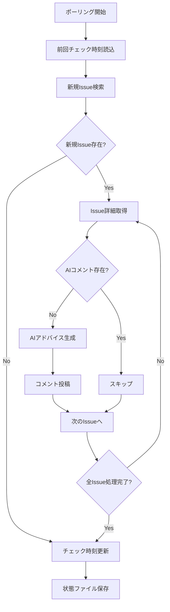

# 重複投稿防止機能の詳細

## 🔒 重複投稿を防ぐ仕組み

RemindMineでは、過去のIssueにAIアドバイスを重複投稿しないための **3重の防止機能** を実装しています。

### 1. 📅 時間ベースフィルタリング

**ファイル**: `redmine_client.py` の `get_issues_since()`
```python
def get_issues_since(self, since_datetime: datetime) -> List[Dict[str, Any]]:
    # Redmine APIで作成日時フィルタリング
    params = {
        'created_on': f">={since_str}",  # 指定日時以降のみ
        'sort': 'created_on:desc',
        'limit': 100
    }
```

**動作**: 前回チェック時刻以降に作成されたIssueのみを取得

### 2. 💾 永続化されたチェック時刻

**ファイル**: `scheduler.py` の状態管理
```python
# 状態ファイル: data/scheduler_state.json
{
  "last_check_time": "2025-08-21T10:30:00+00:00"
}
```

**機能**:
- ✅ **サーバー再起動**: 前回のチェック時刻を復元
- ✅ **プロセス停止**: 最新状態を自動保存
- ✅ **初回起動**: 現在時刻で初期化（過去Issue処理回避）

### 3. 🔍 AIコメント存在チェック

**ファイル**: `redmine_client.py` の `has_ai_comment()`
```python
def has_ai_comment(self, issue_id: int, ai_signature: str = "🤖 AI自動アドバイス") -> bool:
    # Issue内の全コメントをチェック
    for journal in issue['journals']:
        notes = journal.get('notes', '')
        if ai_signature in notes:  # AIシグネチャー検出
            return True
    return False
```

**動作**: 各Issue処理前に、AIアドバイスが既に投稿済みかチェック

## 🛡️ 防止フローの詳細



## ⚙️ 設定オプション

### 環境変数で制御可能

```bash
# .env ファイル
POLLING_INTERVAL_MINUTES=5          # ポーリング間隔
AI_COMMENT_SIGNATURE="🤖 AI自動アドバイス"  # AIコメント識別文字列
```

### 状態ファイルの場所
```
data/scheduler_state.json  # 自動作成・管理
```

## 🧪 テストシナリオ

### ケース1: 正常動作
1. 新規Issue作成
2. 5分後にポーリングで検出
3. AIアドバイス生成・投稿
4. 次回ポーリングで重複回避

### ケース2: サーバー再起動
1. システム停止（状態保存）
2. システム再起動（状態復元）
3. 前回処理済みIssueはスキップ
4. 新規Issueのみ処理

### ケース3: 手動投稿との共存
1. 手動でAIっぽいコメント投稿
2. AIシグネチャー含む場合は重複回避
3. 含まない場合は通常処理

## 🚨 エラーハンドリング

- **状態ファイル破損**: 現在時刻で初期化
- **Redmine接続エラー**: ログ記録してスキップ
- **JSON解析エラー**: フォールバック処理

この3重の防止機能により、RemindMineは安全で信頼性の高いAIアドバイス投稿を実現しています。
