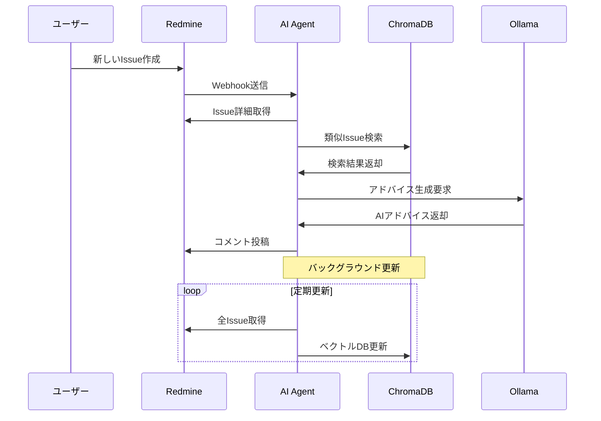

このプロジェクトは開発・学習用のサンプルアプリケーションです。
GitHub Copilot によりソースコードとドキュメントを生成しています。

```
Redmine REST API
ChromaDB（ベクトルストア）
Ollama（ローカルLLM）
LangChain（RAGパイプライン）
Python + FastAPI
を使用して、AI エージェントを作成してください。
1. RedmineのIssue作成をWebHookで受け取る
2. RAGから関連した事例を検索し、アドバイスを Issueへのコメントとして投稿するBot的な動作

と、

Redmine から定期的にIssueとジャーナルを取得して、RAGを更新する

の２つの機能を持ちます。

作成を開始してください。
```

# RemindMine AI Agent 🤖

RedmineとAIを連携させたインテリジェントなIssue解決支援エージェント

新しいIssueが登録されると、過去の類似事例を自動検索してAIが解決策をアドバイスとしてコメント投稿します。

## ✨ 主な機能

- **🔗 Webhook連携**: RedmineのWebhookで新規Issue作成を自動検知
- **🔍 RAG検索**: ChromaDBを使った過去Issue類似検索（意味的検索）
- **🧠 AIアドバイス**: Ollama（ローカルLLM）による解決策提案
- **⏰ 自動更新**: バックグラウンドでの定期的なナレッジベース更新
- **🌐 REST API**: 手動検索・更新用のAPIエンドポイント
- **💻 CLI対応**: コマンドラインからの操作・テスト機能

## 🏗️ システム構成

```
┌─────────────┐    Webhook    ┌──────────────────┐
│   Redmine   │─────────────→│  RemindMine AI   │
│             │               │     Agent        │
└─────────────┘               └──────────────────┘
                                      │
                              ┌───────┼───────┐
                              │       │       │
                        ┌──────────┐ │ ┌─────────────┐
                        │ChromaDB  │ │ │   Ollama    │
                        │(Vector   │ │ │   (LLM)     │
                        │Database) │ │ │             │
                        └──────────┘ │ └─────────────┘
                                     │
                              ┌─────────────┐
                              │ Redmine API │
                              │ (Comment)   │
                              └─────────────┘
```

### 使用技術
- **Redmine REST API**: Issue取得・コメント投稿
- **ChromaDB**: 軽量ベクトルデータベース
- **Ollama**: ローカルLLM実行環境
- **FastAPI**: Webサーバー・APIフレームワーク
- **LangChain**: RAGパイプライン構築
- **Python 3.13**: メイン実装言語

## 📋 前提条件

### 1. Ollama のセットアップ
```bash
# Ollamaをインストール（公式サイトから）
# https://ollama.ai/

# モデルをダウンロード（推奨: llama3.2）
ollama pull llama3.2

# Ollamaサーバーを起動
ollama serve
```

### 2. Redmine の準備
- Redmineが稼働していること
- REST APIが有効になっていること
- API キーが取得済みであること

### 3. システム要件
- Python 3.13+
- Windows 10/11 または Linux
- メモリ: 4GB以上推奨（Ollama用）
- ディスク: 2GB以上の空き容量

## 🚀 インストール

### 1. リポジトリをクローン
```bash
git clone <repository-url>
cd RemindMine
```

### 2. Python仮想環境を作成
```bash
# Windows
python -m venv .venv
.venv\Scripts\activate

# Linux/Mac
python -m venv .venv
source .venv/bin/activate
```

### 3. 依存関係をインストール
```bash
pip install -e .
```

### 4. 設定ファイルを準備
```bash
# Windows
copy .env.example .env

# Linux/Mac
cp .env.example .env
```

### 5. 設定を編集
`.env`ファイルを開いて以下を設定：

```env
# Redmine設定
REDMINE_URL=http://your-redmine-instance.com
REDMINE_API_KEY=your_api_key_here

# Ollama設定（通常はデフォルトのまま）
OLLAMA_BASE_URL=http://localhost:11434
OLLAMA_MODEL=llama3.2

# ChromaDB設定
CHROMADB_PATH=./data/chromadb

# サーバー設定
API_HOST=0.0.0.0
API_PORT=8000

# 更新間隔（分）
UPDATE_INTERVAL_MINUTES=60
```

## 🎯 使用方法

### セットアップテスト
まず、正しくインストールされているか確認：
```bash
python test_setup.py
```

### 1. 📚 RAGデータベースの初期化
既存のRedmine Issueを取得してChromaDBに登録：

```bash
# CLIコマンド
python cli.py update

# または Windows用バッチファイル
update.bat
```

### 2. 🖥️ サーバーの起動
AIエージェントサーバーを開始：

```bash
# CLIコマンド
python cli.py server

# または Windows用バッチファイル（推奨）
start.bat

# または直接FastAPI
uvicorn src.remindmine.app:app --host 0.0.0.0 --port 8000
```

サーバーは `http://localhost:8000` で起動します。

### 3. 🔗 Redmine Webhook設定
Redmine管理画面で以下を設定：

1. **管理** → **設定** → **リポジトリ** に移動
2. **Webhook URL** を追加: `http://your-server:8000/webhook/redmine`
3. **イベント** で「Issue」を選択
4. 保存

### 4. ✅ 動作確認
新しいIssueを作成すると、数秒後にAIアドバイスがコメントとして投稿されます。

## 🛠️ CLI コマンド

### 基本コマンド
```bash
# ヘルプ表示
python cli.py --help

# サーバー起動
python cli.py server

# RAG データベース更新
python cli.py update

# 類似Issue検索テスト
python cli.py search "ログイン エラー"

# AIアドバイス生成テスト
python cli.py advice "データベース接続の問題"
```

### Windows用ショートカット
```bash
# サーバー起動（推奨）
start.bat

# RAG更新
update.bat
```

## 🌐 API エンドポイント

| メソッド | エンドポイント | 説明 |
|---------|---------------|------|
| `GET` | `/` | ヘルスチェック |
| `GET` | `/health` | 詳細ステータス情報 |
| `POST` | `/webhook/redmine` | Redmine Webhook受信 |
| `POST` | `/api/update-rag` | 手動RAG更新 |
| `GET` | `/api/search?query=...&limit=5` | 類似Issue検索 |
| `GET` | `/api/stats` | データベース統計 |

### API使用例
```bash
# 検索API
curl "http://localhost:8000/api/search?query=ログインエラー&limit=3"

# RAG更新API
curl -X POST "http://localhost:8000/api/update-rag"

# 統計情報
curl "http://localhost:8000/api/stats"
```

## 🔄 動作フロー



### 処理の詳細
1. **Issue作成検知**: RedmineのWebhookでリアルタイム検知
2. **類似検索**: ChromaDBで過去Issueの意味的類似検索
3. **アドバイス生成**: Ollamaが類似事例を基に解決策を提案
4. **自動投稿**: RedmineAPIでIssueにコメントを自動追加
5. **定期更新**: バックグラウンドで最新Issueを定期取得・インデックス化

## 📁 プロジェクト構造

```
RemindMine/
├── 📂 src/remindmine/           # メインパッケージ
│   ├── 🐍 __init__.py          # パッケージ初期化
│   ├── 🌐 app.py               # FastAPIアプリ（Webhook処理）
│   ├── ⚙️  config.py            # 設定管理
│   ├── 🔗 redmine_client.py    # Redmine API クライアント
│   ├── 🧠 rag_service.py       # ChromaDB + Ollama RAG
│   └── ⏰ scheduler.py         # バックグラウンド更新
├── 💻 cli.py                   # コマンドライン インターフェース
├── 🎯 main.py                  # メインエントリーポイント
├── 🧪 test_setup.py            # セットアップテスト
├── 📋 pyproject.toml           # プロジェクト設定
├── 🚀 start.bat               # Windows起動スクリプト
├── 🔄 update.bat              # Windows更新スクリプト
├── 🐳 Dockerfile              # Dockerイメージ定義
├── 🐳 docker-compose.yml      # Docker構成
├── 📂 data/                   # データディレクトリ
│   └── chromadb/              # ChromaDBストレージ
├── ⚙️  .env.example            # 環境変数テンプレート
└── 📖 README.md               # このファイル
```

### 主要コンポーネント

| ファイル | 役割 |
|---------|------|
| `app.py` | FastAPIサーバー、Webhook受信、API提供 |
| `redmine_client.py` | Redmine REST API操作（Issue取得・コメント投稿） |
| `rag_service.py` | ChromaDB検索 + Ollama AI生成 |
| `scheduler.py` | バックグラウンド定期更新 |
| `config.py` | 環境変数・設定管理 |
| `cli.py` | コマンドライン操作・テスト |

## 🐳 Docker での実行

### 1. Docker Compose（推奨）
Ollama込みで簡単に起動：

```bash
# .envファイルを編集後
docker-compose up -d

# ログ確認
docker-compose logs -f

# 停止
docker-compose down
```

### 2. 単体Dockerビルド
```bash
# イメージビルド
docker build -t remindmine .

# コンテナ実行
docker run -d -p 8000:8000 \
  -e REDMINE_URL=http://your-redmine.com \
  -e REDMINE_API_KEY=your_key \
  -v $(pwd)/data:/app/data \
  remindmine
```

## 🔧 開発・カスタマイズ

### 開発モードでの起動
```bash
# ホットリロード付きで起動
uvicorn src.remindmine.app:app --reload --host 0.0.0.0 --port 8000
```

### 各機能のテスト
```bash
# 検索機能テスト
python cli.py search "ログイン エラー"

# アドバイス生成テスト
python cli.py advice "パスワードリセットの問題"

# データベース手動更新
python cli.py update
```

### カスタマイズポイント
- **`rag_service.py`**: プロンプトやRAGロジックの調整
- **`config.py`**: 新しい設定項目の追加
- **`app.py`**: Webhook処理やAPI追加
- **`.env`**: 各種パラメータの調整

## 🔍 トラブルシューティング

### よくある問題と解決策

#### 1. Ollama接続エラー
```
❌ Failed to connect to Ollama
```
**解決策:**
```bash
# Ollamaが起動しているか確認
ollama serve

# モデルがダウンロード済みか確認
ollama list

# モデルをダウンロード
ollama pull llama3.2
```

#### 2. Redmine API エラー
```
❌ Failed to fetch issues: 401 Unauthorized
```
**解決策:**
- APIキーが正しいか確認
- RedmineでREST APIが有効か確認
- APIキーに適切な権限があるか確認

#### 3. ChromaDB エラー
```
❌ ChromaDB initialization failed
```
**解決策:**
```bash
# データディレクトリを削除して再作成
rmdir /s data\chromadb  # Windows
rm -rf data/chromadb    # Linux/Mac

# 再度RAG更新実行
python cli.py update
```

#### 4. Webhook が受信されない
**確認ポイント:**
- サーバーが起動しているか: `http://localhost:8000/health`
- Redmineからサーバーにアクセスできるか
- Webhook URLが正しいか: `http://your-server:8000/webhook/redmine`
- ファイアウォールの設定

#### 5. メモリ不足
```
❌ Out of memory
```
**解決策:**
- Ollamaのより軽量なモデルを使用: `ollama pull llama3.2:1b`
- システムメモリを増設
- Dockerのメモリ制限を調整

### デバッグ方法

#### ログ確認
```bash
# 詳細ログでサーバー起動
python cli.py server --log-level debug

# Docker Composeログ
docker-compose logs -f remindmine
```

#### 設定確認
```bash
# 設定値の確認
python -c "import sys; sys.path.insert(0, 'src'); from remindmine.config import config; print(f'Redmine: {config.redmine_url}, Ollama: {config.ollama_base_url}')"
```

#### 手動テスト
```bash
# Redmine接続テスト
curl -H "X-Redmine-API-Key: YOUR_KEY" http://your-redmine.com/issues.json

# Ollama接続テスト
curl http://localhost:11434/api/version

# ChromaDB統計確認
curl http://localhost:8000/api/stats
```

## 🚀 パフォーマンス最適化

### 推奨設定

#### Ollama モデル選択
| モデル | サイズ | 精度 | 速度 | 推奨用途 |
|-------|--------|------|------|----------|
| `llama3.2:1b` | 1GB | 標準 | 高速 | 軽量環境 |
| `llama3.2:3b` | 3GB | 良好 | 標準 | バランス重視 |
| `llama3.2:8b` | 8GB | 高精度 | 低速 | 高品質重視 |

#### ChromaDB 最適化
```python
# .envファイルで調整可能
UPDATE_INTERVAL_MINUTES=30    # 更新頻度（短縮で最新性向上）
```

#### システムリソース
- **最小構成**: 4GB RAM, 2GB ディスク
- **推奨構成**: 8GB RAM, 5GB ディスク
- **高性能構成**: 16GB RAM, 10GB ディスク, GPU

## 📈 機能拡張アイデア

### 実装可能な追加機能
1. **多言語対応**: 英語・中国語などの多言語Issue対応
2. **カテゴリ別検索**: プロジェクト・トラッカー別の検索精度向上
3. **学習機能**: フィードバックによるアドバイス品質向上
4. **通知機能**: Slack・Teams・メール通知
5. **ダッシュボード**: Web UIでの統計・管理画面
6. **API拡張**: GraphQL API、認証機能
7. **プラグイン**: Redmineプラグインとしての統合

### 他システム連携
- **Jira**: Jira Webhook対応
- **GitHub Issues**: GitHub Issues連携
- **Slack**: Slackボット機能
- **Microsoft Teams**: Teamsアプリ統合

## 📞 サポート・貢献

### コミュニティ
- **Issues**: バグ報告・機能要望
- **Pull Requests**: コード貢献大歓迎
- **Discussions**: 使用方法・カスタマイズ相談

### 開発ガイドライン
1. Python PEP 8 準拠
2. 型ヒント必須
3. docstring記述
4. テストコード作成

### ライセンス
MIT License - 商用利用・改変・配布自由

---

## 🎉 最後に

RemindMine AI Agentは、Redmineでの課題解決を効率化するオープンソースプロジェクトです。

皆様のフィードバックと貢献をお待ちしています！

**Happy Issue Solving! 🤖✨**